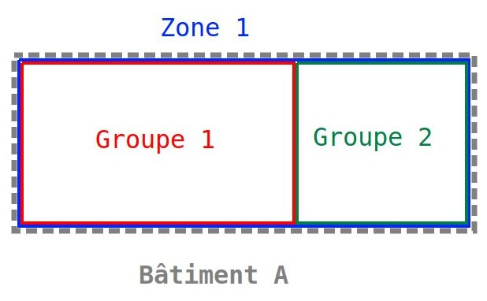

# Exercice Vizcab : estimation du nombre d'occupants d'un bâtiment

## Contexte

Le nombre d'occupants d'un bâtiment est une information importante pour l'estimation
de son impact environnemental, il sert par exemple aux calculs de consommation d'eau potable. Il est estimé à partir de données d'entrées qui sont disponibles
dans le résultat de l'étude thermique (appelé RSET) préalable à l'étude environnementale.

L'objectif est de calculer et d'afficher le nombre d'occupants à partir des données d'entrées disponibles
pour le bâtiment suivant :

### Liste des variables présentes dans le fichier d'entrée RSET

Le fichier d'entrée est `src/data/rset.json`. Les variables nécessaires sont disponibles dans les sections `Batiment` puis `Zone` pour les informations de zone et `Groupe` pour les informations de groupe.

-  : surface utile d'un groupe au sein d'une zone (dans le RSET `SURT`)
-  : nombre de logements en logement collectif et maison accolées défini au niveau d'une zone (dans le RSET `Nb_logement`)
-  : ratio permettant de convertir la surface utile en surface habitable (dans le RSET `Ratio_habitable`)

## Comment démarrer

La base de code utilise VueJS + Vuetify mais l'utilisation d'un autre framework ou de VanillaJS est possible si cela vous convient mieux. La mise en place du dépôt est alors de votre ressort.

### Prérequis

- [git](https://git-scm.com/book/fr/v2/D%C3%A9marrage-rapide-Installation-de-Git)
- npm (via [node](https://github.com/nodesource/distributions/blob/master/README.md))

### Installation

- Cloner le dépôt
- Installer la CLI Vue : `npm install -g @vue/cli`
- Installer les dépendances : `npm install`
- Lancer le serveur : `npm run serve`
- Ouvrir l'application dans le navigateur : `http://localhost:8080/`

## Instructions de l'exercice

### Niveau 1 : calculer la surface moyenne par logement pour chaque zone et l'afficher dans l'interface

1. La surface utile d'une zone est la somme des surfaces des groupes qui la composent :

2. La surface habitable d'une zone est calculée à partir du ratio habitable :

3. Enfin, la surface moyenne par logement pour une zone est obtenue de la manière suivante :

### Niveau 2 : calculer le nombre d'occupants pour chaque zone et l'afficher dans l'interface

1. Calcul du nombre d'adultes maximal par logement pour une zone en fonction de la surface moyenne :

2. Calcul du nombre d'occupants par zone en fonction du nombre d'adultes maximal :

### Niveau BONUS

- comment s'y prendrait-on pour faire varier le nombre de logements et le ratio habitable dans l'interface ?
- comment faire pour gérer un nombre de zones générique au sein d'un bâtiment ?

## Ce qu'on attend de vous

- Ce test sert de base à une discussion, les méthodes employées sont plus importantes que le résultat.
- L'investissement attendu est de 2 ou 3 heures et il n'est pas nécessaire de finir tous les niveaux.
- La qualité de code (tests, commentaires,...) et la clarté des messages de commits seront regardés avec attention.
- En cas de questions, n'hésitez pas à envoyer un [message](mailto:nb-at-vizcab-dot-io) pour demander des précisions ou des explications.

## Sources

http://construction.senova.fr/telechargements/Annexe-arrete-methode-de-calcul-TH-B-C-E-2012-CSTB.pdf - §6.1.3.7.1 (page 64)
